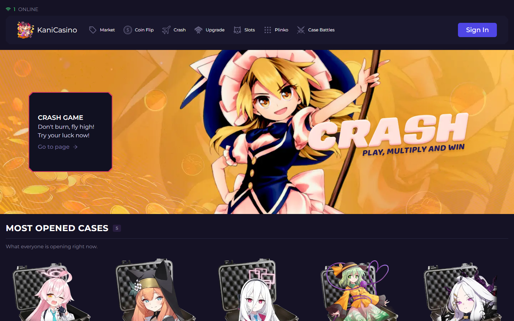
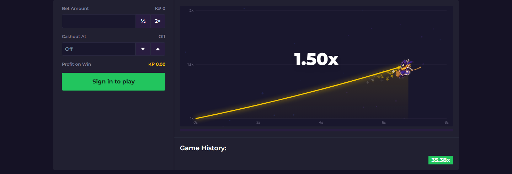
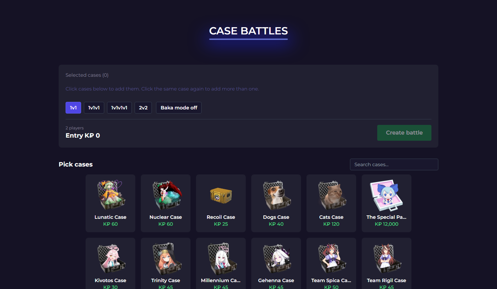
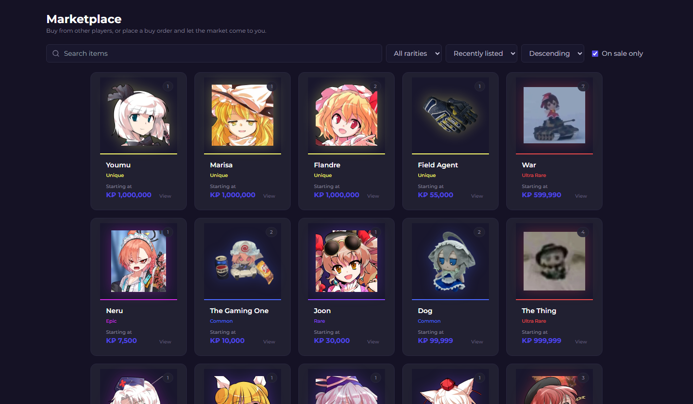
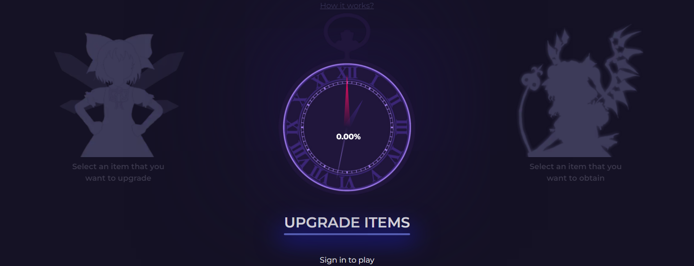
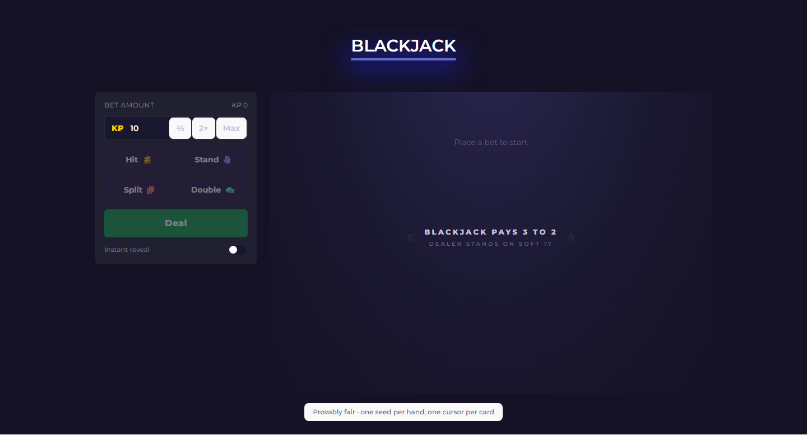
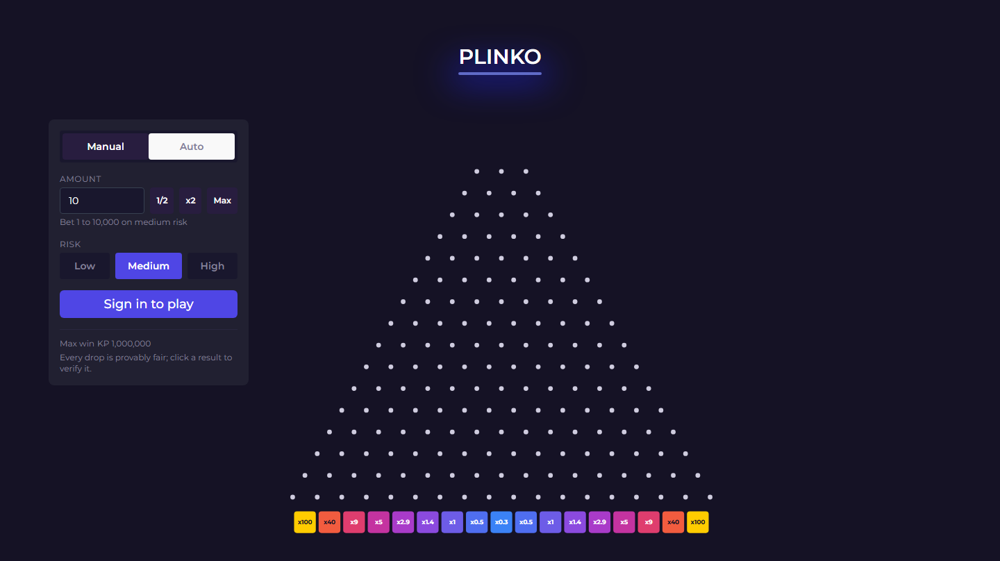
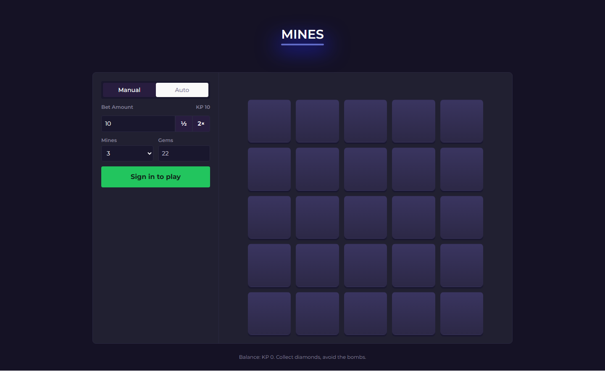
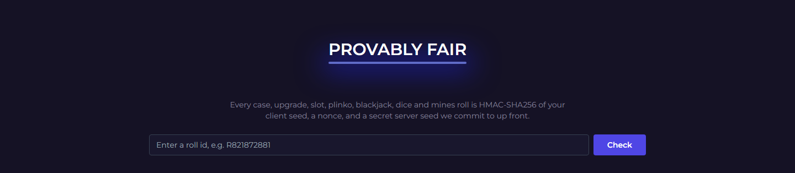

<div align="center">

# KaniCasino

**An open-source, touhou-themed online casino you play with fake coins.**

Live games, Counter-Strike-style case openings, an item marketplace, and a provably-fair engine, all running on a fictional currency (K₽). No real money.

[](https://kanicasino.com)
[](LICENSE)
[](https://github.com/NovaDrake76/KaniCasino/actions/workflows/ci.yml)




</div>

## What is this?

KaniCasino is a full-stack web app that recreates the feel of an online casino for fun, using a fake currency called **K₽**. You get a starting balance, and a free bonus refills your wallet every 8 minutes, so you can keep playing, collecting items, and trading.

> **It is not gambling with real money.** There is no deposit, no withdrawal, and no way to convert K₽ into anything.

**Play it now at [kanicasino.com](https://kanicasino.com).**

## Features

**Games**

- **Crash**: watch the multiplier climb and cash out before it busts, live with everyone online
- **Coin Flip**: pick a side, live rounds
- **Case opening**: Counter-Strike-style cases with rarities and animated reveals
- **Case Battles**: open cases against other players (1v1, 2v2 and more)
- **Blackjack**, **Mines**, **Dice**, **Plinko** and **Slots**
- **Upgrade**: risk an item for a chance at a better one

**Economy & progression**

- **Marketplace**: buy and sell unboxed items, or place buy orders and let the market come to you
- **XP and levels**, a weekly **leaderboard** and **missions** for extra rewards
- **Referrals**: invite friends for a signup bonus
- Every balance change is recorded in a **transaction ledger**

**Trust & tech**

- **Provably fair**: every case, upgrade, slot, plinko, blackjack, dice and mines roll is an HMAC-SHA256 of your client seed, a nonce and a server seed committed up front. You can verify any result on the [Provably Fair](https://kanicasino.com/provably-fair) page.
- **Real-time**: Crash, Coin Flip, the online player count and the global drop ticker run over WebSockets

## Screenshots

|                      Crash                       |                     Case Battles                     |
| :----------------------------------------------: | :--------------------------------------------------: |
|              |         |
|                 **Marketplace**                  |                     **Upgrade**                      |
|  |              |
|                  **Blackjack**                   |                      **Plinko**                      |
|      |                |
|                    **Mines**                     |                  **Provably Fair**                   |
|              |  |

## Tech stack

- **Frontend:** React 18, Vite, TypeScript, TailwindCSS
- **Backend:** Node, Express, Socket.IO, Mongoose (MongoDB)
- **Realtime:** Socket.IO for the live games and pushes

## Getting started

### Run the frontend only

The quickest way to try it out. It talks to the live API.

```bash
npm install
npm run dev
```

Create a `.env` in the project root with:

```
VITE_BASE_URL=https://kanicasino.cfhxo.com
```

### Run the full stack

You'll need your own MongoDB (local or Atlas, the project's database is not public).

1. Install dependencies in both the root and the `backend/` folder.
2. Point the frontend at your local backend by setting `VITE_BASE_URL=http://localhost:5000` in the root `.env`.
3. Create a `backend/.env` with at least:

   ```
   JWT_SECRET=your-secret
   MONGO_URI=your-mongodb-connection-string
   PORT=5000
   ```

4. Start both together:

   ```bash
   npm run start
   ```

You can create your own items and cases from there.

## Contributing

Contributions are welcome, from new games to small fixes. See [CONTRIBUTING.md](CONTRIBUTING.md) for how to set up, branch and open a pull request. You can also report bugs or suggest ideas in the [issues](https://github.com/NovaDrake76/KaniCasino/issues).

## License

Licensed under the [GNU GPL v3.0](LICENSE). You're free to use, study, share, and modify the code, as long as derivative work stays open under the same license.

## Credits

KaniCasino is a non-commercial fan project. All trademarks and art belong to their respective owners. If you own an asset used here and want it removed, contact novadrake76@gmail.com.

**Cases**

- Touhou items by [dairi](https://www.pixiv.net/en/users/4920496)
- Counter-Strike items by [Valve](https://store.steampowered.com/app/730/CounterStrike_2/)
- Cats items from the [Hello Street Cat Wiki](https://streetcat.wiki/index.php/Main_Page)

**Games**

- Crash art and banner from Urban Legend in Limbo
- Slots art from Touhou Kouryuudou ~ Unconnected Marketeers; Mike art by [kamepan44231](https://x.com/kamepan44231/status/1641809628412477446)
- Coin Flip art by [azumammeri](https://x.com/azumammeri)
- Cirno profile picture by [AshleyChan-D](https://www.deviantart.com/ashleychan-d/art/Cirno-Fumo-Fanart-854752870)
- Casino banner by [Gensokyo 2077](https://www.pixiv.net/en/artworks/110665474)
- Mike banner by [Azura](https://www.pixiv.net/en/users/106357304)
- Joon logo by [忍忍](https://www.pixiv.net/en/artworks/66805800)
